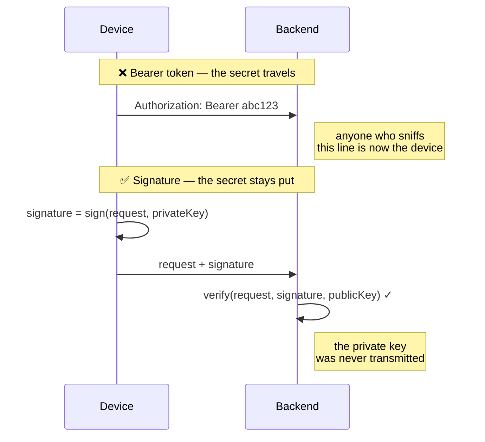
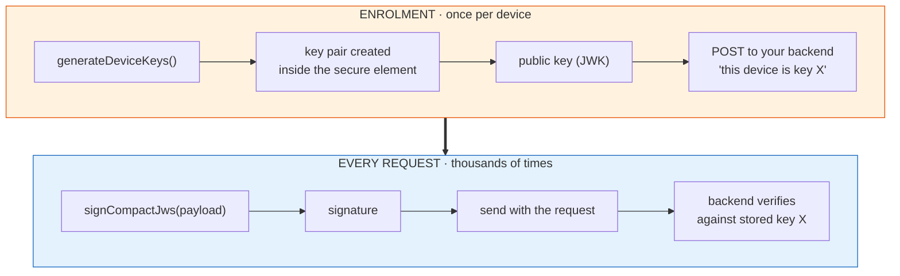
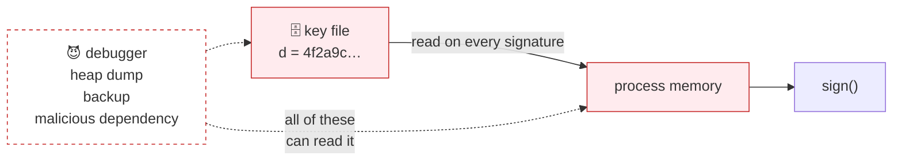
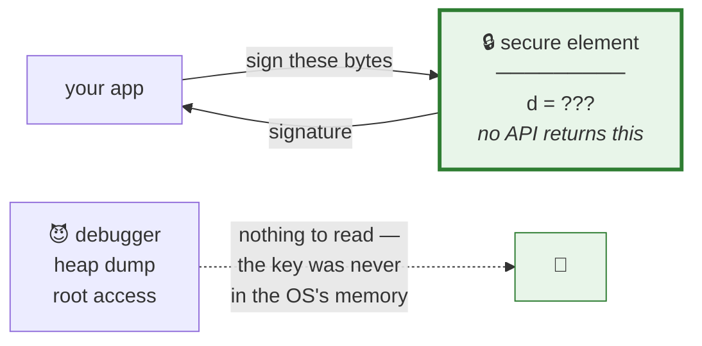
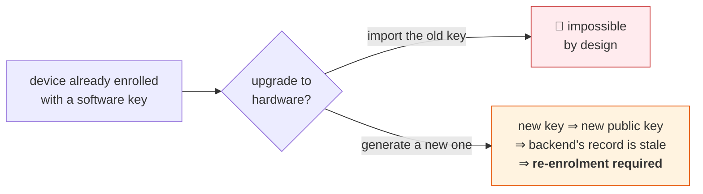

# 1 · The problem

[← index](README.md) · next: [How it works →](02-how-it-works.md)

---

## Start with the goal

Your backend receives a request. It wants to answer one question:

> Did this really come from the device I enrolled, or from someone replaying
> traffic / running a script / using a stolen token?

A password or bearer token cannot answer that. A token is **a secret you send**,
so anyone who captures it becomes you. What you want is **a secret you prove you
have, without sending it.** That is what a signature does.

Capturing a signature gets an attacker nothing: it is valid for *that exact
request* and no other. (Include a timestamp and a nonce in the payload and it is
not even replayable.)

---

## Enrolment, then use

Two phases. Get this shape in your head and the API makes sense.

The private key never appears in either phase. Only the **public** half is ever
transmitted, and a public key is not a secret — publishing it costs you nothing.

---

## So why is this hard? Where does the key live?

This is the entire problem. You have a private key. It has to persist across app
restarts. Where do you put it?

### Attempt 1 — a variable in JavaScript

Gone when the page reloads. And any script on the page can read it: one
compromised npm dependency and your device credential is exfiltrated.

### Attempt 2 — a file on disk

Survives restarts. But the bytes are *right there*. Malware, a backup, a heap
dump, someone with the laptop — all get the key. And every time you sign, the
key must be loaded into memory, so anything that can read the process sees it.

### Attempt 3 — the secure element ✅

Modern phones have a chip (or an isolated CPU mode) that:

1. **Generates** the key internally — the key is *born* in there
2. **Signs** on request — you hand it bytes, it hands back a signature
3. Has **no export function** — not "export is protected", but *there is no such
   API at all*

That is the property this plugin delivers. Android calls it AndroidKeyStore
(backed by TEE or StrongBox); Apple calls it the Secure Enclave.

---

## The catch that shapes everything else

**A hardware key cannot be imported.** You cannot take an existing key and move
it into the secure element — if you could, it would have been extractable, which
defeats the point.

So:

This is why the plugin has no `importKey`, and why
[`MIGRATION.md`](../MIGRATION.md) describes migration *strategies* rather than
providing a migration *function*. Moving a fleet onto hardware keys is a
product decision (do you force it? offer it? gate a new feature on it?), not
something a library can do behind your back.

---

## And the catch that creates the two-key model

A secure element signs **whatever it is asked to sign**. It proves the request
came from this device. It does *not* prove a human was involved.

For that you add a second condition: *the element refuses to sign until a
biometric or passcode is presented*. But you cannot put that condition on the
key that signs every background poll — there is no screen to prompt on.

Hence two keys. That is [document 4](04-two-key-model.md).

---

[← index](README.md) · next: [How it works →](02-how-it-works.md)
