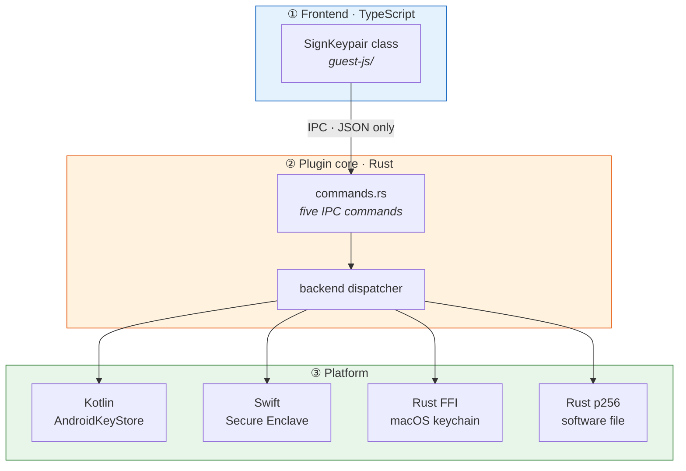
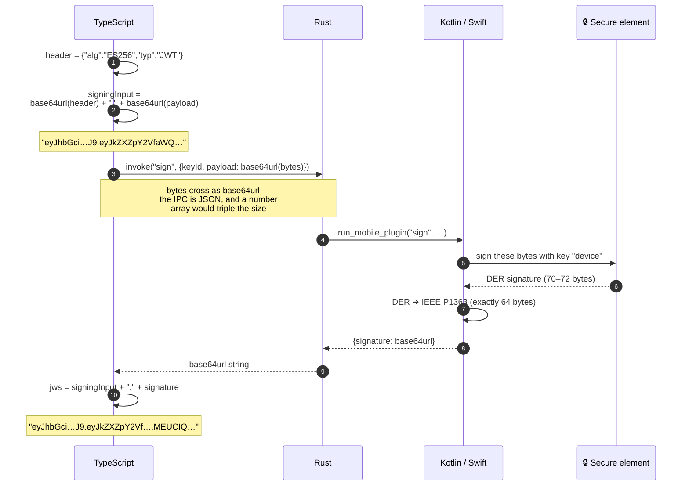
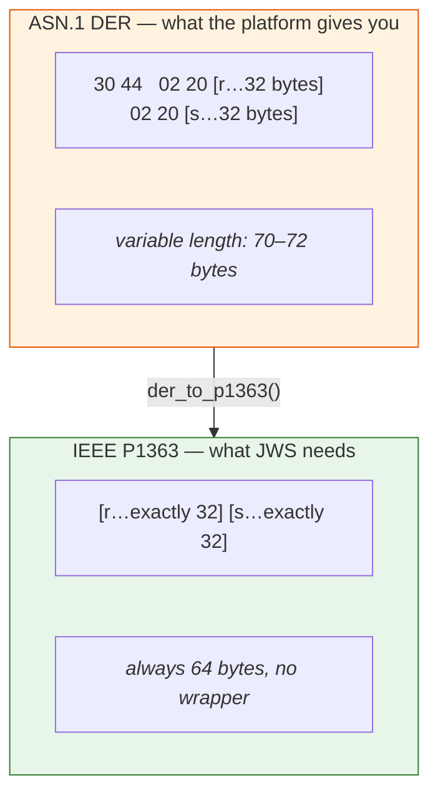
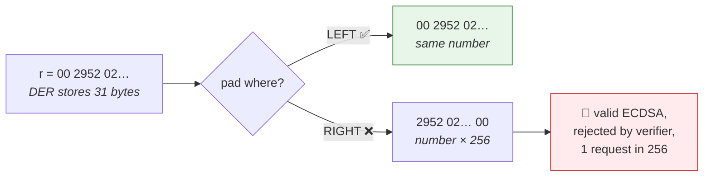
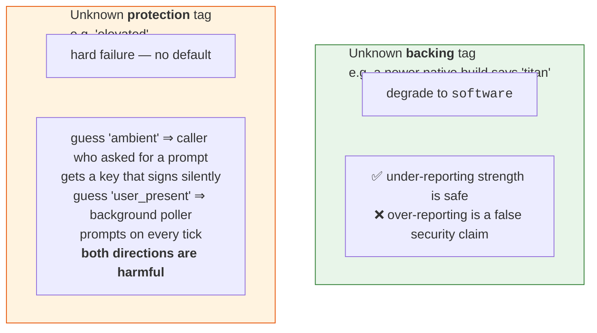

# 2 · How it works

[← the problem](01-the-problem.md) · [index](README.md) · next: [Platforms →](03-platforms.md)

---

## The layers

A Tauri app is a **web frontend** talking to a **Rust backend** over a message
bus (the "IPC"). On mobile, Rust in turn talks to native Kotlin or Swift. So one
`signCompactJws()` call crosses three boundaries.



**Why so many layers?** Each one exists because the layer below it cannot be
reached directly. The WebView cannot call AndroidKeyStore. Rust cannot draw a
biometric prompt. Kotlin cannot be compiled into a macOS binary. Every boundary
is forced, not chosen.

---

## What actually travels: a worked example

You call:

```ts
await signer.signCompactJws({ device_id: 'abc', method: 'POST' })
```

Here is every step, with the actual data.



The result is one string with three dot-separated parts — that is all a compact
JWS is:

```
eyJhbGciOiJFUzI1NiIsInR5cCI6IkpXVCJ9 . eyJkZXZpY2VfaWQiOiJhYmMifQ . G7c819mlr7KMg…
└──────── header ────────┘             └────── payload ──────┘      └── signature ──┘
        base64url of the JSON            base64url of your JSON       base64url of 64 bytes
```

Your backend hands that string to any standard JWS library plus the public key
it stored at enrolment, and gets back yes or no.

---

## The one conversion that causes real bugs

Every platform's crypto API returns a signature in **ASN.1 DER**. JWS `ES256`
requires **IEEE P1363**. They encode the same two numbers differently.



### Why this is dangerous rather than merely fiddly

DER encodes integers **minimally**. If `r` happens to start with a zero byte, DER
stores 31 bytes instead of 32. P1363 always wants 32, left-padded with zero.

- That happens roughly **1 time in 256** per component.
- A naive conversion produces a signature that is *valid ECDSA* and that a JWS
  verifier *rejects*.
- So the bug ships, works for weeks, and then one request in ~128 fails with no
  useful error.



This is why the conversion exists **three times** (Kotlin, Swift, Rust) and each
copy is tested against the *same* known-answer vectors — see
[verification](05-verification.md).

---

## The wire vocabulary, and the asymmetry that matters

The IPC carries JSON, so enums cross as strings. Each language maps
string↔enum in exactly one place and compares on the enum everywhere else.

What a language does with a string it does **not** recognise differs on purpose:



That asymmetry is the single most load-bearing design decision in the plugin.

---

## Where things live in the repo

```
src/                    Rust plugin core
 ├── lib.rs             registration, the SignKeypairExt trait
 ├── commands.rs        the five IPC commands
 ├── models.rs          the wire vocabulary (KeyBacking, KeyProtection, …)
 ├── error.rs           SignerErrorCode + the {code, message} wire error
 ├── asn1.rs            DER ➜ P1363  (Rust copy)
 ├── mobile.rs          adapter to the Kotlin / Swift plugins
 └── desktop/
     ├── mod.rs         Backend trait + one-time probe/dispatch
     ├── macos.rs       Secure Enclave via Security.framework FFI
     └── software.rs    p256, one file per key

android/…/              Kotlin: SecureKeyStore, BiometricPrompt, Wire, codec
ios/Sources/SignKeypair/ Swift: Plugin, Wire, codec
guest-js/               TypeScript API + WebCrypto fallback
darwin_tests/           standalone SwiftPM tests (symlinks to the real sources)
examples/tauri-app/     runnable demo for all targets
```

---

[← the problem](01-the-problem.md) · [index](README.md) · next: [Platforms →](03-platforms.md)
