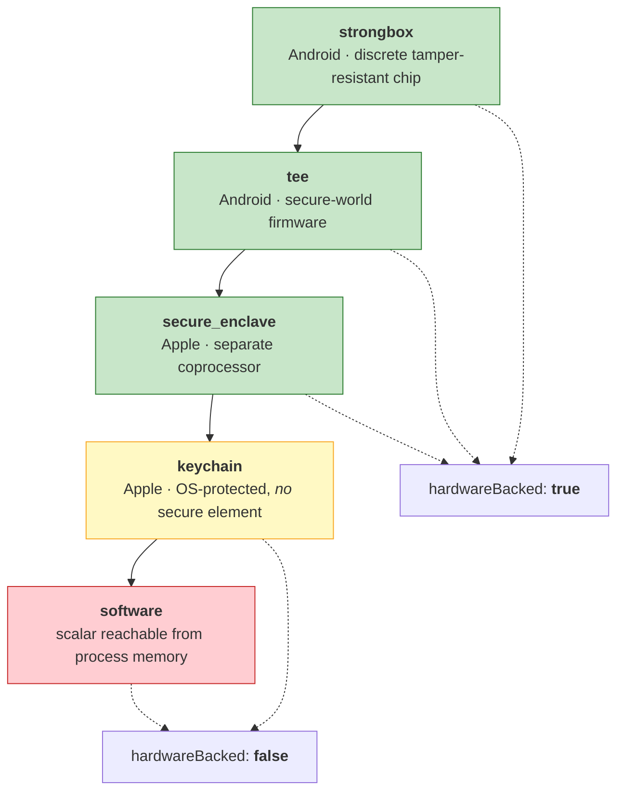
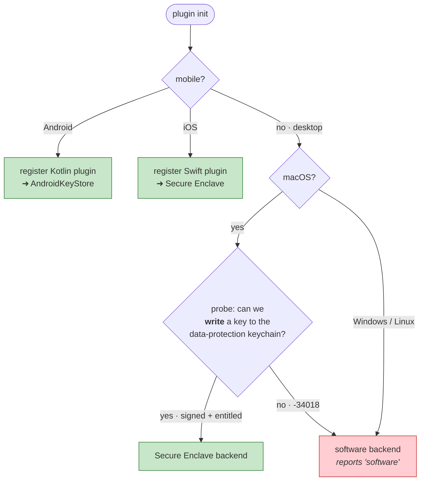
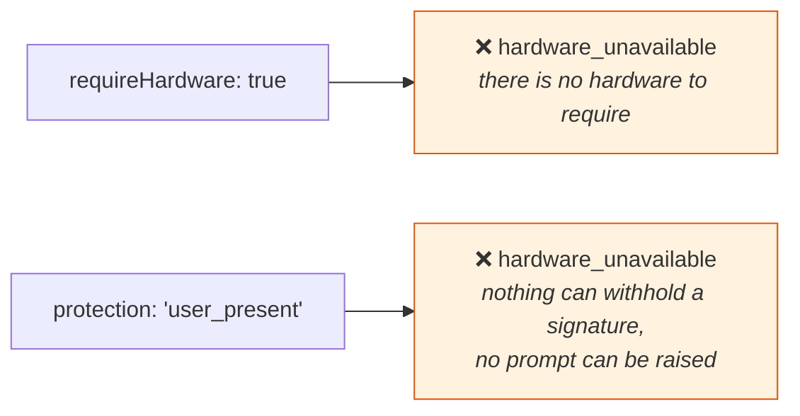
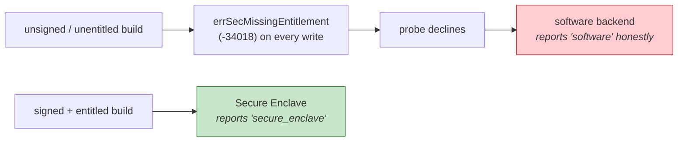

# 3 · Platforms

[← how it works](02-how-it-works.md) · [index](README.md) · next: [Two-key model →](04-two-key-model.md)

---

## The ladder

`KeyBacking` is ordered by **decreasing assurance**. The only question it really
answers is: *can the private key be read out of this device?*

**`keychain` is deliberately on the `false` side.** A keychain item is protected
by the OS, but no secure element is *holding* it — in principle it can be
exported. Putting it on the `true` side would be a claim the plugin cannot back.

---

## What each target actually gets you

| Target | Backend | Backing | `hardwareBacked` | Verified? |
|---|---|---|---|---|
| **Android** | AndroidKeyStore + BiometricPrompt | `strongbox` → `tee` → `software` | true on real hardware | ✅ emulator (reports `software` — correct, see below) |
| **iOS** | Secure Enclave, `SecKeyCreateSignature` | `secure_enclave` / `keychain` | **true** | ✅ simulator, real Secure Enclave |
| **macOS** | Security.framework FFI | `secure_enclave` / `keychain` → `software` | true *if signed & entitled* | ⚠️ fall-back path only |
| **Windows** | — not implemented — | `software` | false | ✅ via software tests |
| **Linux** | — not implemented — | `software` | false | ✅ via software tests |
| **Web** | WebCrypto, non-extractable `CryptoKey` | `software` | false | ✅ unit tests |

---

## The decision the plugin makes at startup

The probe runs **once**. Re-probing per call would mean a machine whose secure
element became unavailable mid-session could silently start issuing software
keys *under the same key id* — the caller would see a key id it recognises with
a backing it did not expect, which is exactly the confusion `hardwareBacked`
exists to prevent.

---

## Two refusals, everywhere there is no secure element

The software and WebCrypto backends **refuse** rather than pretend:

The second one deserves the emphasis. There is no secure element to withhold a
signature and no platform prompt to raise, so a "user-present" key would sign
happily with **nobody at the keyboard**. Issuing one would make every downstream
check that compares protection against key id — an audit log, a risk score, a
backend that demands the prompting key for a transfer — assert something untrue
about how the signature was produced.

The consequence is that a browser or a Windows build **cannot do user-present
operations at all**. That is the correct outcome: a degraded target, not a
quietly-equivalent one.

---

## Two traps worth knowing

### An emulator cannot prove hardware backing

An Android emulator ships a **software keymaster**. `capabilities()` there
reports `software` and `hardwareBacked: false` — the plugin being honest, not
broken. What an emulator *does* prove is everything except residency: that the
key is created in AndroidKeyStore rather than process memory, that
`getEncoded()` is null, that the DER→P1363 conversion is right, that
BiometricPrompt is raised with the authenticators the key was created with, and
that the signature verifies.

An iOS simulator on Apple silicon is different — it exposes a **real** Secure
Enclave, which is why the iOS test shows `hardwareBacked: true`.

### macOS silently degrades without an entitlement

A Secure Enclave key on macOS must live in the data-protection keychain, and
writing there needs a code-signed app with `keychain-access-groups`:

The probe deliberately performs a **write**, not a read: an unsigned binary is
allowed to read that keychain, so a read-based probe passes and then every real
call fails. See the [build log](06-build-log.md) — that was a real bug.

---

[← how it works](02-how-it-works.md) · [index](README.md) · next: [Two-key model →](04-two-key-model.md)
