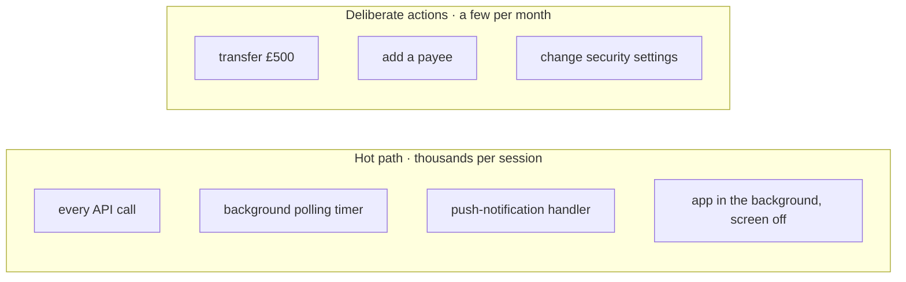
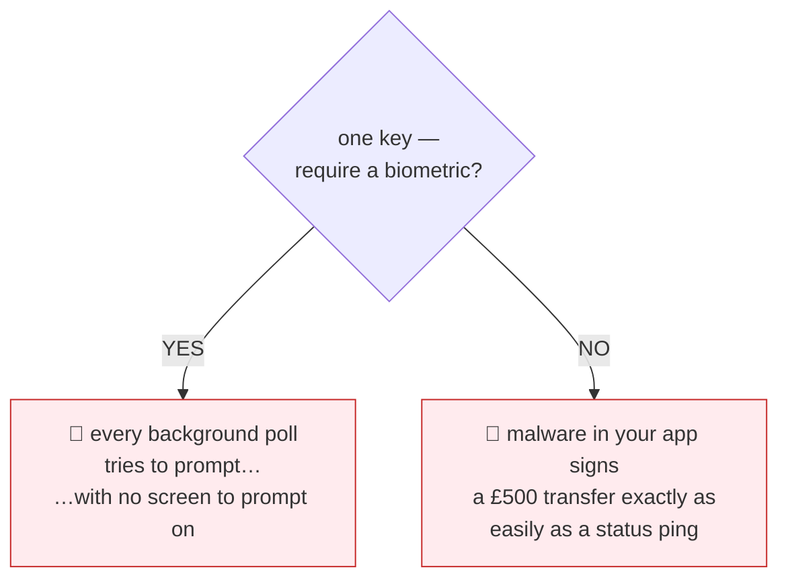
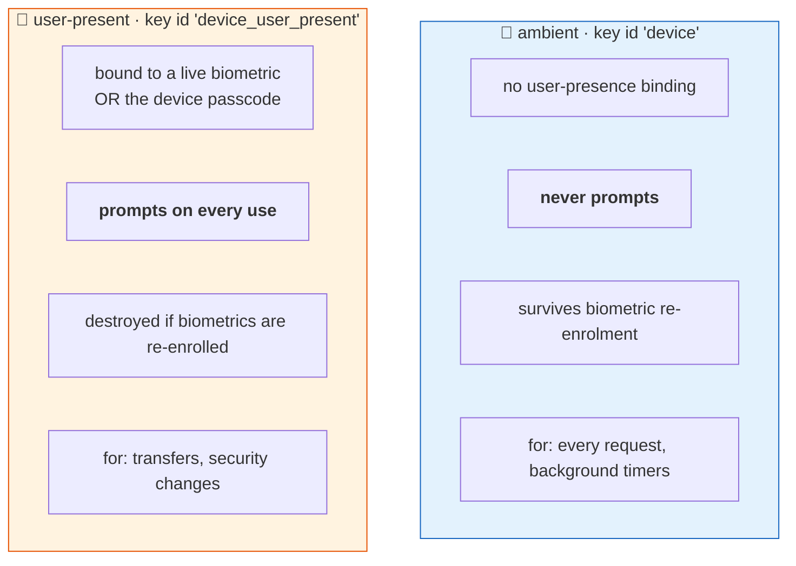
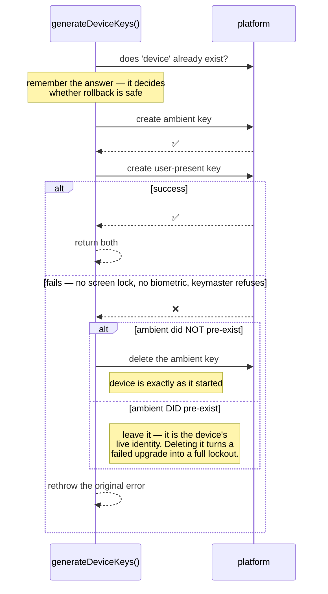
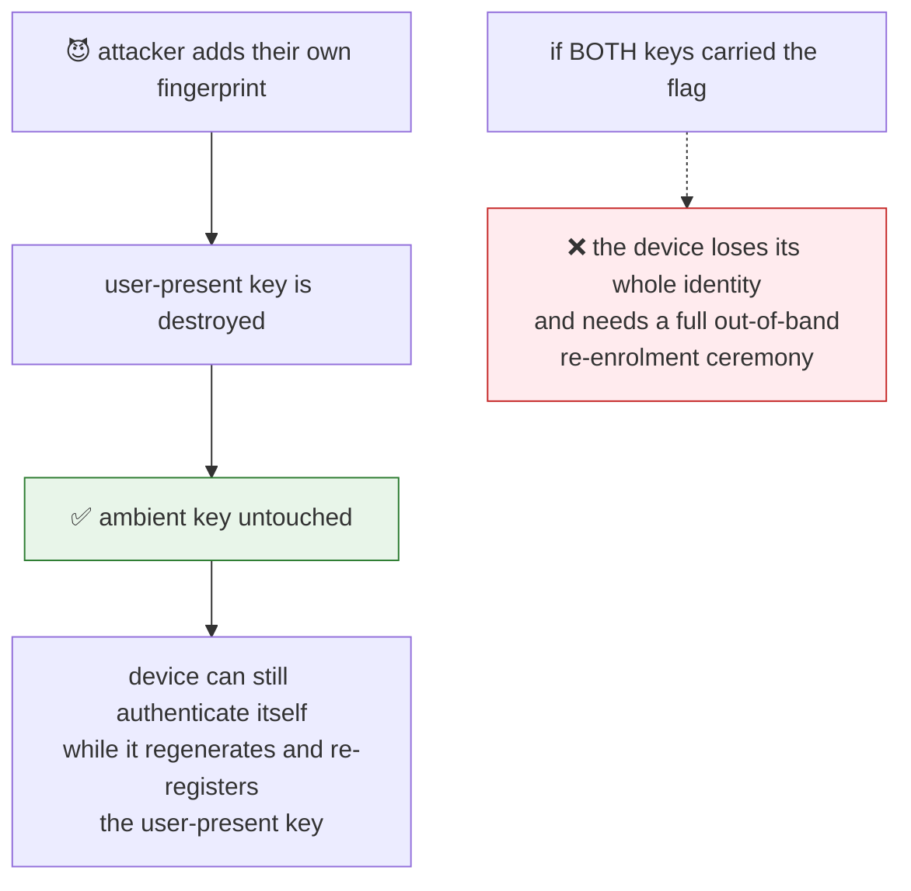
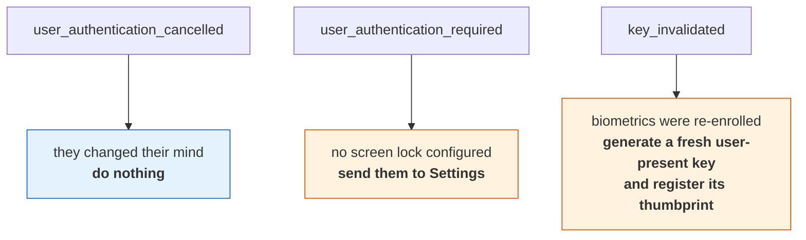

# 4 · The two-key model

[← platforms](03-platforms.md) · [index](README.md) · next: [Verification →](05-verification.md)

---

## The problem one key cannot solve

Your app signs two very different kinds of request:

Now try to serve both with **one** key:

Neither is acceptable. So: **two keys**, with different rules baked in at
creation time.

---

## The split

### Why two key *ids* rather than a flag

The platform stores the policy **with the key**. One alias cannot be both
prompting and silent, and rewriting it to switch would destroy the key. So the
protection level is permanent from the moment of creation — which is also why an
unrecognised protection tag is a hard failure rather than a default.

### What the split actually buys

In-process malware can still *use* the ambient key — a secure element signs
whatever it is asked to. It **cannot** use the user-present one without a human
authenticating. So your backend can require the stronger key for a sensitive
endpoint and that requirement means something.

---

## Enrolment is all-or-nothing

**The hazard this closes:** a device holding an ambient key the backend has never
seen is *worse* than a device holding neither. It looks enrolled to itself and
unknown to the server, so every request is rejected — and the client cannot tell
that from a revocation.

---

## Biometric invalidation, and why only one key carries it

Both platforms can destroy a key when the biometric enrolment changes:
`setInvalidatedByBiometricEnrollment(true)` on Android, `.biometryCurrentSet` on
Apple. The plugin puts that flag on the **user-present key alone**.

### Being precise about what the flag buys

Less than it first reads. Both platforms accept the **device credential**
(passcode / screen lock) alongside biometrics, and neither invalidates a key on
the credential branch. So the flag only bites on the biometry branch.

That does not open a hole, and the reason is worth internalising: **both
platforms require the existing credential before they will accept a newly
enrolled biometric.** An attacker who can add a fingerprint already holds what
the surviving branch would have asked for. The flag is a statement of intent
that costs nothing and helps on the branch where it applies.

The credential branch exists because a meaningful share of real hardware has no
working biometric sensor. Requiring biometrics specifically would lock those
users out of your sensitive operations entirely.

---

## Three failures, three different responses

`SignKeypairError.code` distinguishes them, and **none of the three is a reason
to log the user out**:

Flatten these into one generic error and you will send someone through a full
re-enrolment ceremony because they tapped "Cancel".

---

[← platforms](03-platforms.md) · [index](README.md) · next: [Verification →](05-verification.md)
