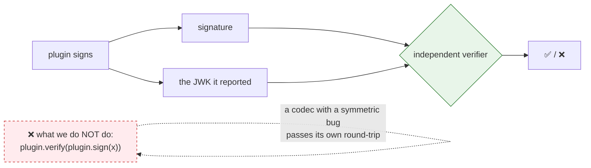
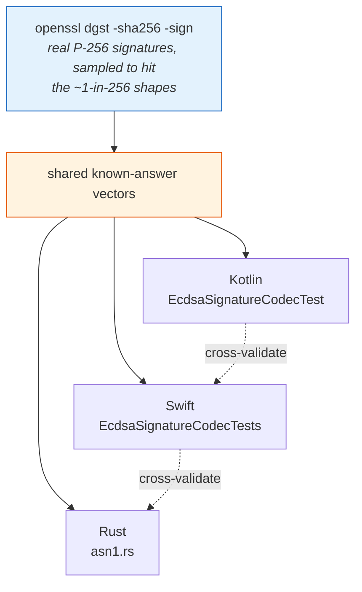
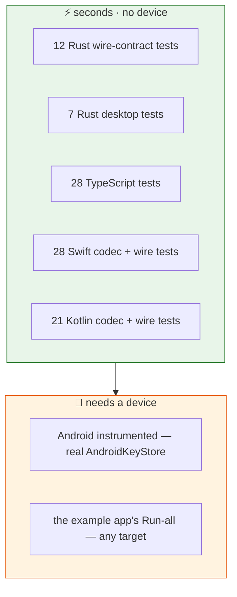
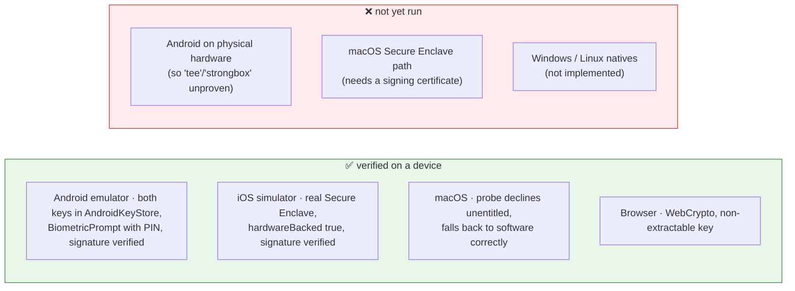

# 5 · How we know it works

[← two-key model](04-two-key-model.md) · [index](README.md) · next: [Build log →](06-build-log.md)

---

## The principle: never let code mark its own homework

Every signature test verifies against **the public key the plugin handed out**,
using a **third-party verifier** — never the plugin's own code.



| Backend | Verifier used | Where |
|---|---|---|
| Rust software | the `p256` crate's verifier | `tests/desktop_signer.rs` |
| WebCrypto | `crypto.subtle.verify` | `guest-js/web-backend.test.ts` |
| AndroidKeyStore | `java.security.Signature` | `android/src/androidTest/` |
| Any, on-device | `crypto.subtle.verify` in the WebView | the example app's **verify** button |

All of them also assert the signature is **exactly 64 bytes**. A DER signature is
70–72 bytes and would fail verification roughly 1 time in 256 rather than every
time — which is precisely the bug that ships.

---

## Known-answer vectors, not round-trips

The DER→P1363 conversion exists three times. Each copy is tested against the
**same** fixed inputs and expected outputs.



Each expected value was computed independently, re-encoded to DER, and confirmed
with `openssl dgst -sha256 -verify` against the real public key — so the
expectations are anchored to a third-party implementation, not to our own output.

**Why known answers rather than round-trips:** a round-trip can be
self-consistently wrong. An encoder and a decoder sharing the same padding bug
cancel each other out and the test passes. A fixed input with a fixed expected
output cannot do that.

Covered in each language: a short `r`, a short `s`, both short, a high-bit
component carrying DER's `0x00` sign byte, the `r=1, s=2` extreme, a zero
component, long-form lengths, an always-64-bytes property check, and ten
malformed inputs (empty, truncated, wrong tag, overrunning length, zero-length
INTEGER, trailing bytes) that must fail cleanly rather than read out of bounds.

---

## The wire contract, pinned three times

The string↔enum mapping is duplicated once per language, and duplication drifts.
So the exact strings are asserted in `tests/wire_contract.rs`,
`WireContractTest.kt` and `WireContractTests.swift`. A rename on one side turns
into a red build on that side, instead of a runtime failure on one platform.

| Unknown value arrives | Result | Why |
|---|---|---|
| backing tag | `software` | under-reporting strength is harmless; over-reporting is a false claim |
| protection tag | **hard failure** | both wrong guesses are harmful — no safe default exists |
| error code | `unknown`, raw string kept | diagnosable rather than flattened |

---

## The test pyramid



**96 tests run without any device.** The Swift suite is a standalone SwiftPM
package whose sources are *symlinks* to the files the plugin ships — so it
exercises the real code, not a copy that could drift, and it needs no simulator,
no Tauri runtime and no keychain.

---

## What has actually been run, and what has not

Honesty about coverage matters more than a green badge.



An emulator **skips** the hardware-residency assertion rather than passing it.
A skipped assertion is honest; a passing one on a software keymaster would be a
lie told by the test suite.

---

## Running everything

```bash
cargo test && cargo clippy --all-targets -- -D warnings   # Rust
npm install && npm test && npm run typecheck              # TypeScript
cd darwin_tests && swift test                             # Swift (~1s, no simulator)

# Kotlin — from the example's generated host project
cd examples/tauri-app && npm install && npx tauri android init
cd src-tauri/gen/android && ./gradlew :tauri-plugin-sign-keypair:testDebugUnitTest
```

---

[← two-key model](04-two-key-model.md) · [index](README.md) · next: [Build log →](06-build-log.md)
