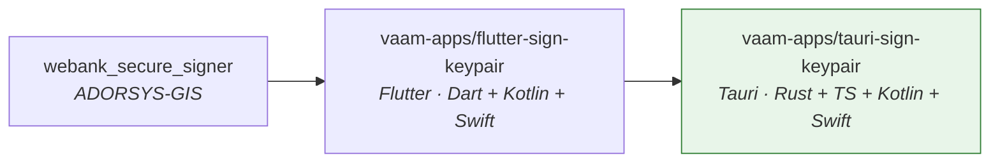
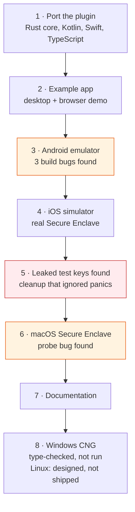
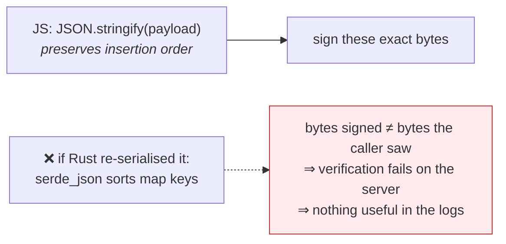
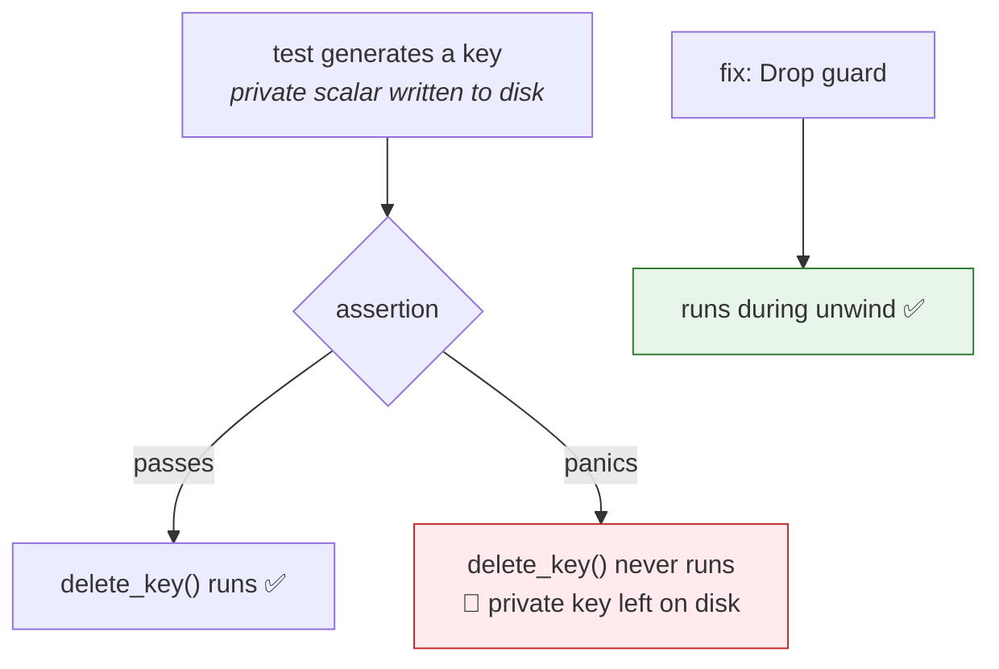
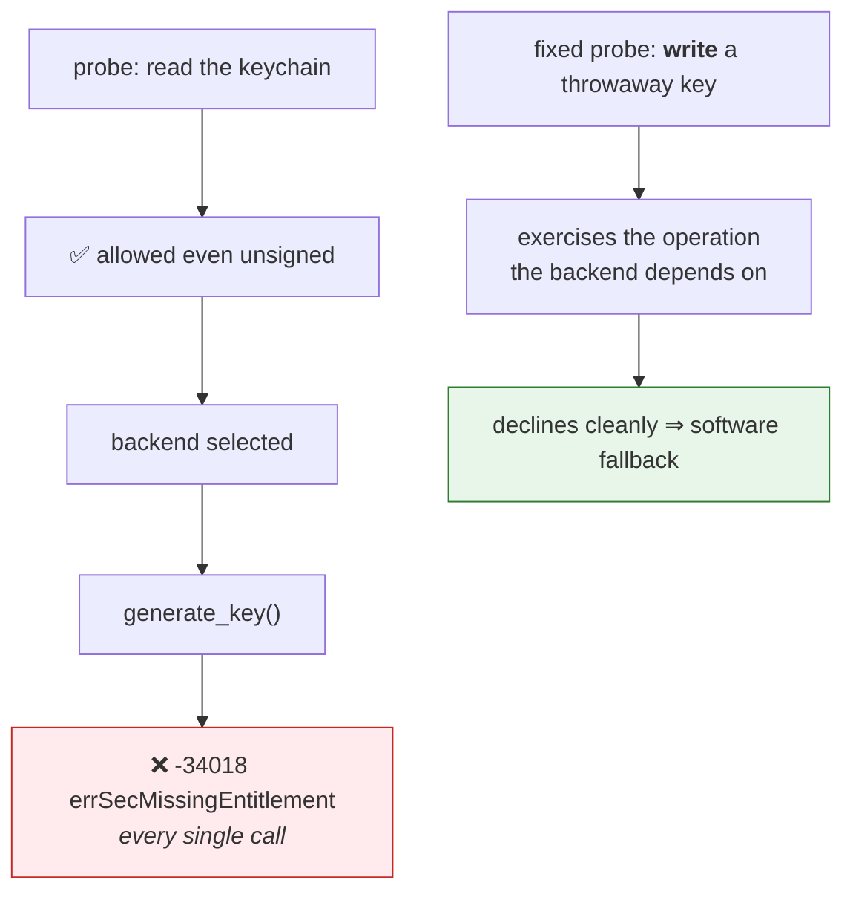
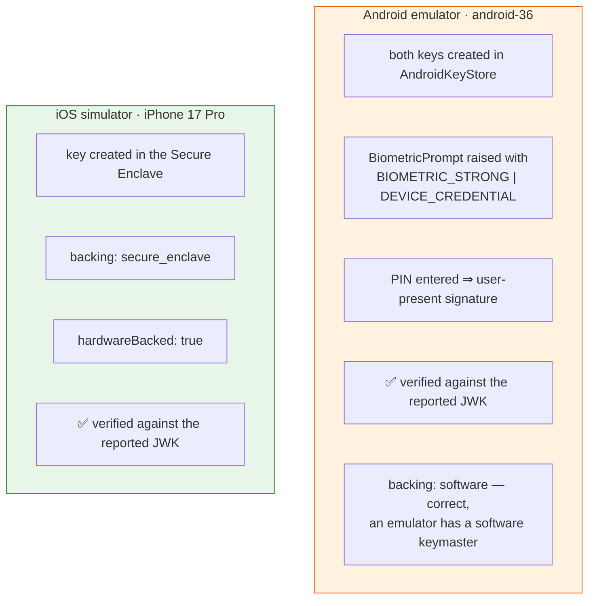

# 6 · Build log

[← verification](05-verification.md) · [index](README.md)

A record of how this plugin was built, in order, including every bug found and
why it mattered. Useful if you are extending it — most of these traps are still
there waiting for the next backend.

---

## Where it came from

The Kotlin and Swift keystore code is a close port. The Rust core, the
TypeScript API and the WebCrypto fallback are new, because Tauri's architecture
is different: a WebView frontend over a Rust backend, with native code reached
only on mobile.

---

## The timeline

---

## Design decisions, and what they cost

### Bytes cross the IPC as base64url

The Tauri IPC carries JSON. A `Uint8Array` serialises as an array of numbers,
roughly tripling a signing input. So `sign` takes and returns unpadded
base64url.

*Consequence:* one base64url implementation per language, and the frontend's
encoder is chunked — `String.fromCharCode(...bytes)` overflows the call stack on
a payload whose size the caller chooses.

### JWS assembly lives in TypeScript only

There is no `sign_compact_jws` IPC command, deliberately.

Rust callers get `jws::signing_input`, which takes an already-serialised string
for the same reason.

### Every Rust command is `async`

Not style. `sign` for a user-present key **blocks** until BiometricPrompt
resolves, and BiometricPrompt needs the Android main thread to draw itself. A
synchronous Tauri command runs on that thread — so it would deadlock on the
prompt it is waiting for.

### One file per key on the software backend

The first design was one JSON file holding a map of all keys. That makes every
write a read-modify-write of the whole store, so two instances of the same app
race and the loser's device key silently disappears. **The parallel test run
caught this.** Per-key files mean a write touches only the key it is about.

---

## The bugs, in order

### 🐛 1 · The example could not build for mobile at all

`tauri android build` refused it outright. Tauri's mobile targets do not run a
`main`: Android dlopens the app as a shared object and calls the
`#[tauri::mobile_entry_point]` symbol from Kotlin; iOS links it as a static
library.

**Fix:** builder moves to `lib.rs` behind that attribute, `main.rs` becomes a
desktop shim, `[lib] crate-type = ["staticlib", "cdylib", "rlib"]`.

### 🐛 2 · `version: "0.0.0"` is rejected by Android

Android will not accept it as a package version. A one-line fix, but it stops
the build dead.

### 🐛 3 · The headline feature was unreachable from the UI

The example could *enrol* the user-present key but had no button to *sign* with
it — so the one behaviour the two-key split exists for could not be demonstrated.
Fixed by adding the button, which then proved the whole biometric path worked.

### 🐛 4 · The documented Kotlin test command could not work

README and CI said `cd android && gradle testDebugUnitTest`. But `android/` is a
Gradle **subproject** with no wrapper and no settings of its own — it cannot be
built standalone. The tests run from the example's generated host project, whose
`tauri.settings.gradle` includes the plugin as `:tauri-plugin-sign-keypair` and
supplies its `app.tauri.*` dependencies.

### 🐛 5 · Test cleanup that leaked private keys

The desktop suite wrote cleanup as a `delete_key` line at the **end of the test
body**. That line does not run when an assertion above it panics.

A failing run left two P-256 private keys in the user's Application Support
directory, where nothing later removed them — made worse because the store
layout had changed in between, so `deleteKey()` computed a path that did not
match the file. **Fix:** cleanup hangs off `Drop`. Verified by writing a test
that generates a key and then panics on purpose, then checking the directory was
empty. That probe was removed afterwards — an always-failing test in the tree is
a trap for the next person.

A leaked *test* key is not a real credential. But a signing library whose suite
strews private key material around on failure is the wrong habit, and the same
pattern in an integration test against a real keystore would leave real keys.

### 🐛 6 · The macOS probe tested the wrong operation

*(The Windows probe was written correctly the first time **because** of this
one — it creates and deletes a key rather than merely opening the provider.
Three backends in, "probe the operation you actually depend on" is the rule.)*

The Secure Enclave backend probes at startup to decide whether it can be used.
The first version did a keychain **lookup** — which an unsigned binary is
perfectly allowed to do.

Reads and writes to the data-protection keychain have **different entitlement
requirements**, so a probe has to exercise the one that matters. The existing
desktop test suite caught this within seconds of the backend being wired in.

---

## What testing on real devices proved

The Android logs confirmed the authenticator policy from the *system's* side, not
just ours: `StrengthRequested: 15` (BIOMETRIC_STRONG), `CredentialRequested:
true`, fingerprint `Ineligible` (none enrolled), `CredentialAvailable: true` →
falls through to the PIN. That is exactly what the Kotlin asks for on API 30+.

---

## Still outstanding

| Item | Why it is not done |
|---|---|
| **macOS enclave path, exercised** | Needs an Apple Developer signing identity for the `keychain-access-groups` entitlement. Ad-hoc signing cannot carry it — the app is rejected at launch. |
| **`reason` on macOS** | The prompt is raised by the access-control flags, but *captioning* it needs an `LAContext`, which means Objective-C interop. |
| **Windows, at runtime** | Implemented and type-checked against the real `windows` crate bindings, but never executed — no Windows machine was available. |
| **Linux TPM 2.0** | Designed, not shipped — see [document 7](07-linux-tpm.md). No verification was possible at all, not even a type-check. |
| **Android on physical hardware** | Only an emulator was available, so `tee` / `strongbox` backing is unproven in practice. |

---

[← verification](05-verification.md) · [index](README.md)
