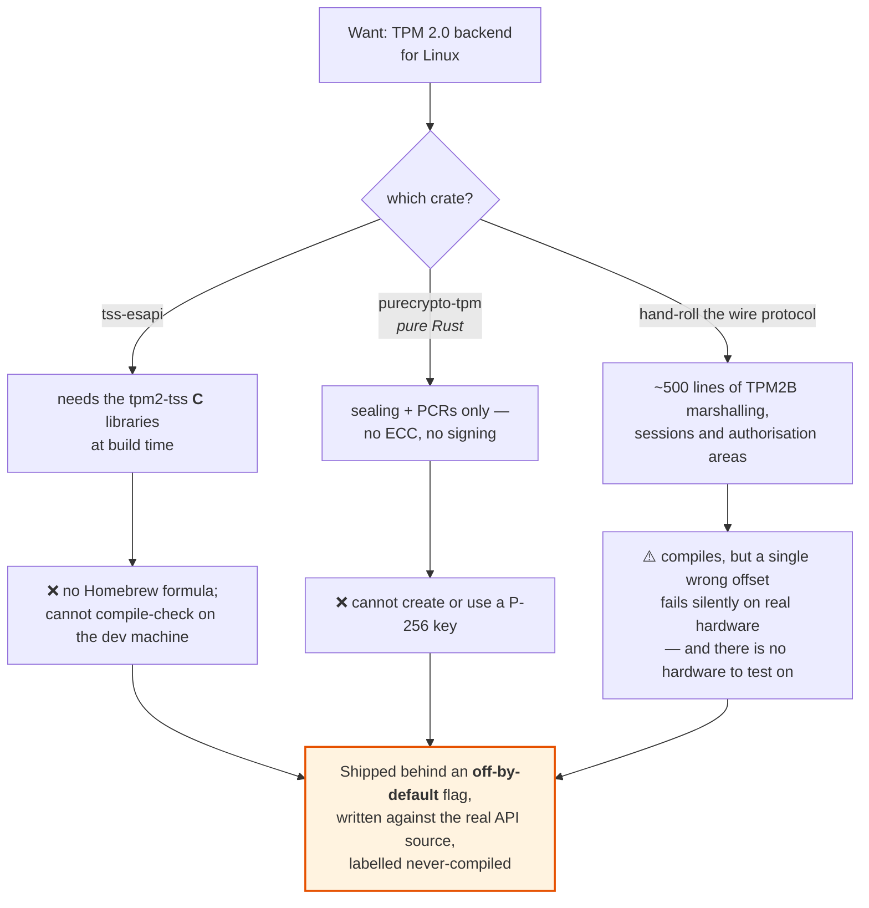
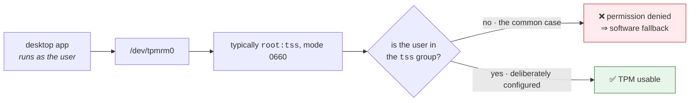
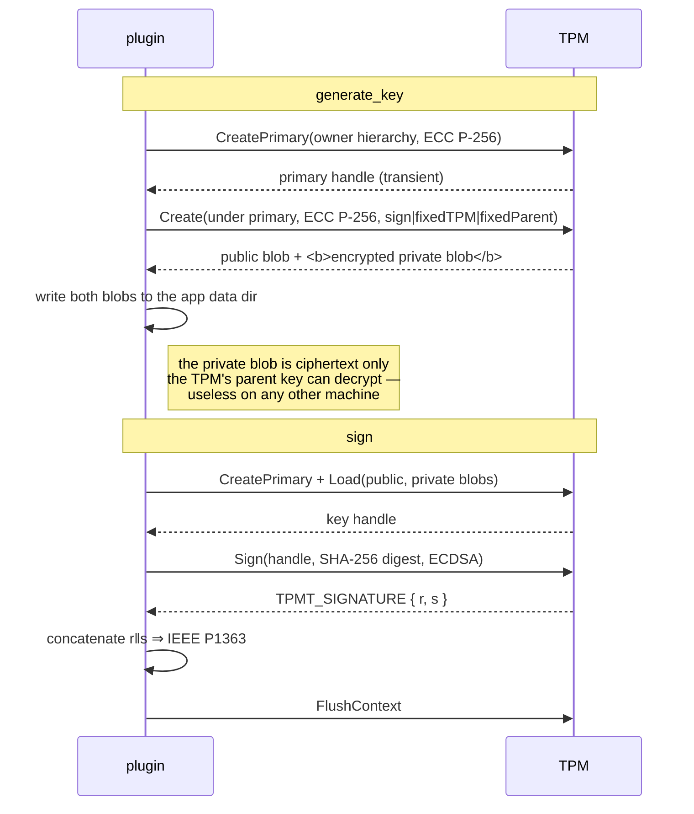

# 7 · Linux TPM — shipped behind a flag, never compiled

[← build log](06-build-log.md) · [index](README.md)

> **Status.** `src/desktop/linux.rs` implements the full `Backend` trait against
> the real `tss-esapi` 7.7 API, behind the **off-by-default** `linux-tpm`
> feature.
>
> It **compiles** — CI builds it on a Linux runner with `libtss2-dev` and it
> passes `clippy -D warnings`, as a required check. It has **never been run
> against a TPM**. Compiling is not working: the command sequence, the object
> attributes, the blob round-trip and the `r`/`s` padding are all unexercised.
>
> With the flag off — the default — none of it is compiled and every other
> target is unaffected.

This document is the design it implements, the reasoning about what could and
could not be verified, and the steps to actually validate it.

---

## The short version



The Windows backend ships because it **type-checks against the real API
bindings** (`cargo check --target x86_64-pc-windows-msvc`). No equivalent
verification exists for Linux: the Tauri Linux target cannot even be
cross-checked from macOS, because its GTK/WebKit dependencies need system
libraries that pkg-config cannot find for a foreign target.

---

## The other reason: most Linux desktops cannot use a TPM anyway

Even a perfect implementation would fall back to software on the majority of
machines.



Unlike Android and iOS, where the secure element is always there and always
reachable by any app, a Linux TPM is opt-in system administration. That does not
make the backend worthless — a managed fleet can configure it — but it does mean
the software fallback stays the common path, so the *urgency* is lower than the
Windows or macOS equivalents.

---

## What the implementation would be

For whoever picks this up. It plugs into the same seam as the others: a module,
a `probe() -> Option<Self>`, and a `Backend` impl.

### Build gating

`tss-esapi` links the `tpm2-tss` C libraries, which are absent on most build
machines. So it **must** be behind a default-off feature, or every Linux
consumer's `cargo build` breaks:

```toml
[features]
linux-tpm = ["dep:tss-esapi"]

[target.'cfg(target_os = "linux")'.dependencies]
tss-esapi = { version = "7", optional = true }
```

### The key lifecycle

TPM keys are not simply "stored under a name" the way AndroidKeyStore aliases or
NCrypt key names are. The usual pattern:



Two details that differ from every other backend here:

- **`fixedTPM | fixedParent`** are the object attributes that make the key
  non-migratable. Without them the key can be duplicated to another TPM, and the
  backend would be reporting `tee` for something extractable.
- **The blobs go on disk, not in the TPM.** Persisting a key inside the TPM
  (`EvictControl`) consumes scarce NV storage — a few dozen slots on typical
  hardware — so a library that persists per key would exhaust it. The encrypted
  blob on disk is the standard trade: it is useless without *this* TPM.

### Reporting and refusals

| Question | Answer |
|---|---|
| `backing` | `tee` — same reasoning as Windows: a discrete chip, but `strongbox` means Android StrongBox specifically in this vocabulary |
| `require_hardware` | no check needed; reaching this backend means the probe succeeded |
| `user_present` | **refuse.** A TPM can require an auth value per use, but there is no OS-level biometric prompt and no binding to a biometric enrolment — the same reasoning that refuses it on Windows |
| probe | must **create and delete** a key, not merely open the device. Opening `/dev/tpmrm0` succeeds on a machine whose TPM then refuses key creation — the same trap that was found on both macOS and Windows |

### Validating it — still required

Nothing below has been done. The minimum before trusting this module:

1. `cargo build --features linux-tpm` on a Linux box with `libtss2-dev`
2. run against the **TPM simulator** (`swtpm`) for correctness
3. run against **real hardware** for permissions and NV behaviour
4. assert the signature verifies against the reported JWK, as every other
   backend's tests do

---

## Current Linux behaviour

**Default (`linux-tpm` off):** software signer, per-key file in the app data
dir, `backing: "software"`, `hardwareBacked: false`, `user_present` refused.
Fully implemented and covered by the seven desktop tests.

**With `linux-tpm` on:** the probe runs first. It opens `/dev/tpmrm0` (or
`$TCTI`) and *creates and deletes* a key — not merely opening the device, which
succeeds on machines whose TPM then refuses key creation. If anything fails, the
software signer takes over and reports `software` honestly. So even an enabled,
unvalidated TPM path degrades rather than breaking the app.

---

[← build log](06-build-log.md) · [index](README.md)
