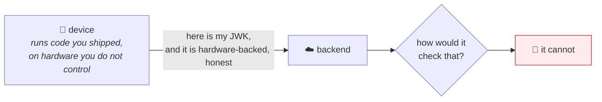
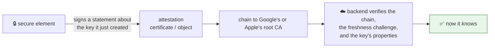
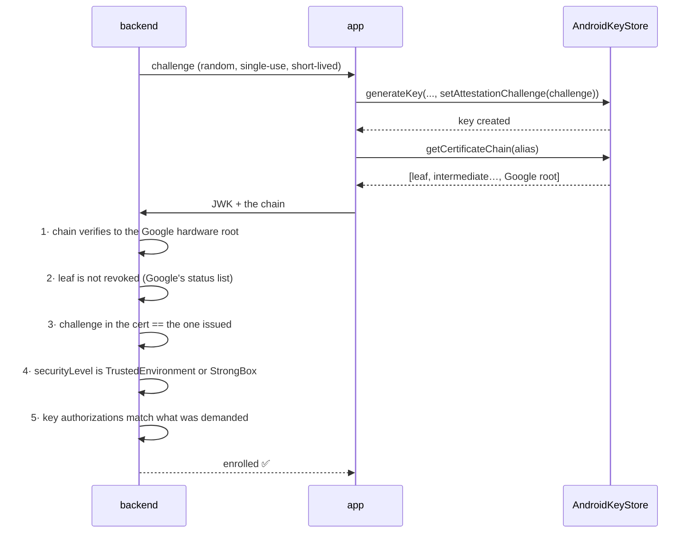
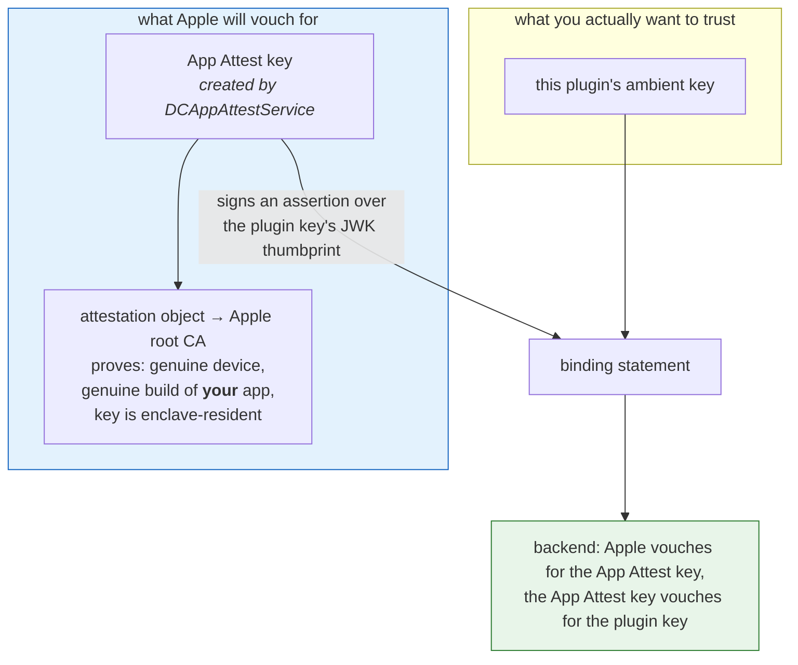
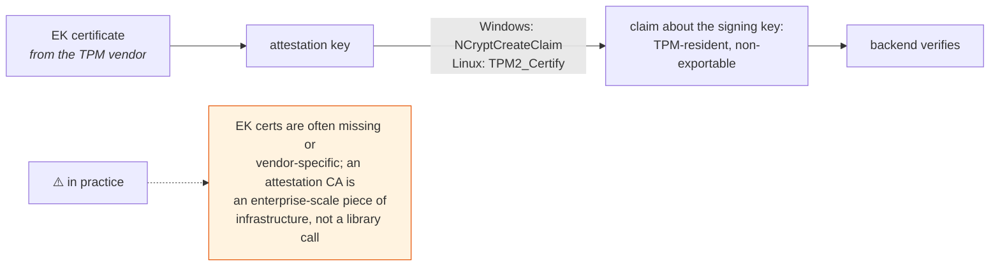
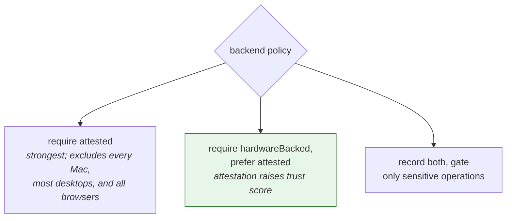

# 8 · Attestation — the gap, and what closing it looks like

[← Linux TPM](07-linux-tpm.md) · [index](README.md)

> **Status: design sketch. Nothing here is implemented.** The API shapes and
> verification steps below are drawn from each platform's documented primitives
> and have not been built or tested. Treat it as a starting point for a design
> review, not a specification to code against.

---

## The problem in one picture

Today, `hardwareBacked: true` is **the client's word for it**.



The plugin is careful never to *over*-claim — an emulator reports `software`, an
unentitled macOS build reports `software`, an unknown backing tag degrades to
`software`. All of that is honest reporting by **code the attacker controls**.
Patch the app, or replay the registration call from a script, and you can assert
`hardwareBacked: true` over a key that lives in a text file.

Attestation replaces the claim with a certificate the *silicon vendor* signed.



---

## The awkward truth: it is not uniform

This is why attestation cannot be one tidy cross-platform method. The platforms
differ not in API detail but in **what is possible at all**.

| Platform | Mechanism | Attests *this plugin's* key? | Practical? |
|---|---|---|---|
| **Android** | Key Attestation — a real X.509 chain to a Google root | ✅ directly | ✅ free, standard, works today |
| **iOS** | App Attest (`DCAppAttestService`) | ❌ — attests *its own* key; must be bridged | ⚠️ indirect, see below |
| **macOS** | — none — | ❌ | ❌ App Attest is iOS/tvOS only |
| **Windows** | TPM key attestation (`NCryptCreateClaim`) | ✅ | ⚠️ needs an EK cert + attestation CA |
| **Linux** | `TPM2_Certify` with an attestation key | ✅ | ⚠️ same, plus EK certs are often absent |
| **Web** | — none — | ❌ | ❌ WebAuthn is a different protocol |

Any design that assumes a single `getAttestation()` returning a single blob will
break on the second platform it meets.

---

## Android — the one that just works



The leaf certificate carries a `KeyDescription` extension (OID
`1.3.6.1.4.1.11129.2.1.17`) describing the key the TEE actually created: its
security level, its purposes, its digests, and whether user authentication is
required. That last point matters for [the two-key model](04-two-key-model.md) —
it is how a backend can verify that the key it is told is `user_present`
*genuinely* carries `userAuthenticationRequired`, instead of taking the key id's
word for it.

Three caveats worth knowing before promising this:

- **Step 2 is not optional.** Google publishes a status list of attestation keys
  extracted from compromised devices. Skipping the revocation check leaves the
  most valuable attack — a leaked vendor key — wide open.
- Not every device implements attestation correctly, and some cheap hardware
  ships broken or absent chains. You need a policy for "attestation
  unavailable", and that policy is a product decision.
- The challenge is baked in **at key creation**. It cannot be added afterwards.

---

## iOS — attest a different key, then bridge

Apple provides **no attestation for arbitrary Secure Enclave keys.** App Attest
creates *its own* enclave key and attests that. So you cannot attest this
plugin's key directly; you transfer trust to it.



The chain of reasoning is sound but it is **one link longer** than Android's, and
the extra link is only as strong as the binding statement's freshness. It needs
the same server-issued challenge, and the backend must track App Attest's
assertion counter to reject replays.

**macOS gets nothing.** App Attest is iOS and tvOS only. A Mac with a Secure
Enclave can hold a perfectly good non-extractable key and has no way to prove it.
That asymmetry should be stated in whatever policy you build, because "require
attestation" would otherwise silently exclude every Mac.

---

## Windows and Linux — possible, and heavier than they look

Both TPM paths work the same way in principle: an **attestation key** signs a
structure describing the target key, and the verifier needs a reason to trust
that attestation key — which means the TPM's **endorsement key certificate**,
issued by the TPM vendor, and usually a privacy/attestation CA in between.



For a consumer desktop app this is usually not worth it. For a managed fleet,
where you already run a CA and control the hardware, it is very much worth it.
That split should drive whether it is built at all.

---

## What the API would have to look like

One constraint dictates the shape: **on Android and iOS the challenge is
consumed at key-creation time.** It cannot be supplied afterwards. So attestation
cannot be a method you call on an existing key — it has to ride along with
enrolment.

```ts
// The challenge MUST come from the server. A client-generated one proves
// nothing: replaying an old attestation is exactly the attack.
const challenge = await backend.beginEnrolment()

const keys = await signer.generateDeviceKeys({ attestationChallenge: challenge })

await backend.completeEnrolment({
  ambient: keys.ambient.publicKey,
  userPresent: keys.userPresent.publicKey,
  // Absent on macOS, Windows, Linux and web. Present on Android and iOS.
  // The `format` tells the backend which verification routine to run — there
  // is no common parser.
  attestation: keys.attestation,   // { format, data } | null
})
```

And the reporting has to change, because there are now **two different claims**
and conflating them would undo the whole point:

| Field | Means |
|---|---|
| `hardwareBacked` | the device *says* the key is in a secure element |
| `attested` | a vendor CA *proves* it, and the backend checked |

A device can be `hardwareBacked: true, attested: false` — a Mac, a TPM-less
Windows box, or an Android device with broken attestation — and that is a
perfectly ordinary state, not an error.



---

## Where it would live in this repo

Each backend already has the seam. Attestation is an addition to
`generate_key`, not a new subsystem:

| Piece | Change |
|---|---|
| `models.rs` | `attestation: Option<Attestation>`, `attested: bool`, and an `AttestationFormat` enum — a **fourth** wire vocabulary, needing the same one-place-per-language discipline and the same three-suite contract tests |
| Kotlin | `setAttestationChallenge()` in `createKeyPair`, `getCertificateChain()` in `describeKey` |
| Swift | `DCAppAttestService` plus the binding assertion — a genuinely new flow, not a parameter |
| `desktop/*` | `NCryptCreateClaim` / `TPM2_Certify`, or return `None` |
| `software`, `web` | always `None`, refusing to fake it, exactly as they refuse `user_present` |

The honest warning for whoever picks this up: **the verification is the hard
part, and none of it is in this repo.** Parsing the Android `KeyDescription`
extension, checking Google's revocation list, validating an App Attest CBOR
object and tracking its counter — that is all backend work, in whatever language
your server is written in. This plugin can only ever hand over the blob.

---

[← Linux TPM](07-linux-tpm.md) · [index](README.md)
