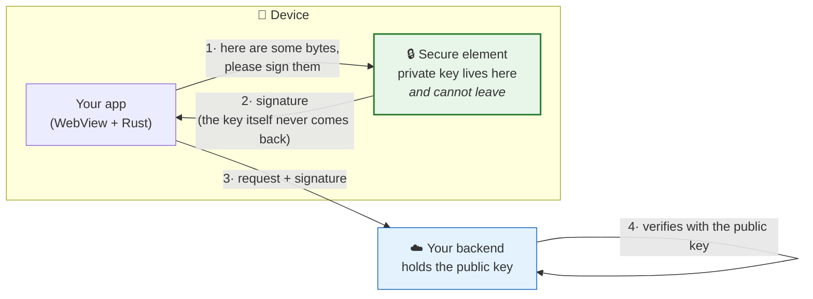
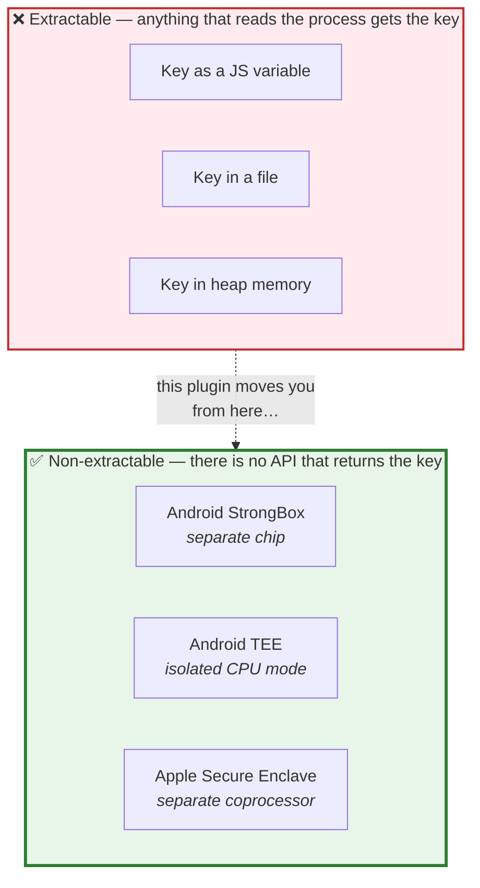

# Understanding `tauri-plugin-sign-keypair`

Written for someone who has **not** worked with device keys, secure elements or
JWS before. It starts from "what is a signature" and ends at "why is there a
`hardware_backed` boolean and why does it matter".

Read in order:

| # | Document | What it answers |
|---|---|---|
| 1 | **[The problem](01-the-problem.md)** | What is this for? What is a device-bound key, and why not just store a password? |
| 2 | **[How it works](02-how-it-works.md)** | What actually happens when you call `signCompactJws()`. The layers, the data, the diagrams. |
| 3 | **[Platforms](03-platforms.md)** | Six targets, four levels of protection. What each one really gives you. |
| 4 | **[The two-key model](04-two-key-model.md)** | Why two keys instead of one, and what breaks if you use one. |
| 5 | **[How we know it works](05-verification.md)** | Testing strategy: known-answer vectors, cross-validation, and what an emulator can't prove. |
| 6 | **[Build log](06-build-log.md)** | Every decision and every bug found, in order, from empty directory to tested on four platforms. |
| 7 | **[Linux TPM](07-linux-tpm.md)** | The design for the one backend that is not implemented, and the reasoning for not shipping it yet. |

---

## The one-paragraph version

Your backend wants to know that a request really came from *this* phone. So the
phone holds a private key and signs each request; the backend holds the matching
public key and checks the signature. The whole scheme collapses if the private
key can be copied off the device — so this plugin never lets the key exist
outside the phone's **secure element**: a separate chip that generates the key
internally, signs on request, and has no API to export it. When a platform has
no such chip, the plugin says so honestly rather than pretending.

---

## Vocabulary, once

You can read everything else once you have these seven terms.

| Term | Plain meaning |
|---|---|
| **Key pair** | Two matched numbers. The **private key** makes signatures; the **public key** checks them. Knowing the public one tells you nothing useful about the private one. |
| **Signing** | Running a message + the private key through a formula to get a short tag — the *signature*. Anyone with the public key can confirm the tag matches that exact message. |
| **P-256** | The specific maths (an elliptic curve) used here. Apple's Secure Enclave supports only this curve, and the JWS standard for `ES256` requires exactly this curve — a lucky alignment. |
| **ES256** | "ECDSA using P-256 and SHA-256." The signature scheme this plugin implements. |
| **JWS** | JSON Web Signature. A standard way to package `header.payload.signature` into one URL-safe string that any backend library can verify. |
| **Secure element** | A separate chip (or isolated CPU mode) that stores keys and does crypto. The main OS can ask it to sign but cannot read the key out. Android calls it TEE/StrongBox; Apple calls it the Secure Enclave. |
| **Extractable** | Whether the private key can be read out as bytes. A key in a file is extractable. A key in a secure element is not. This single property is what the plugin is about. |

---

## The one diagram to remember

Everything in this repo exists to keep the private key inside the green box.

The plugin reports which box you are in as `hardwareBacked: true | false`.
**It never guesses upward.** If it cannot prove you are in the green box, it
says `false` — see [Platforms](03-platforms.md).
